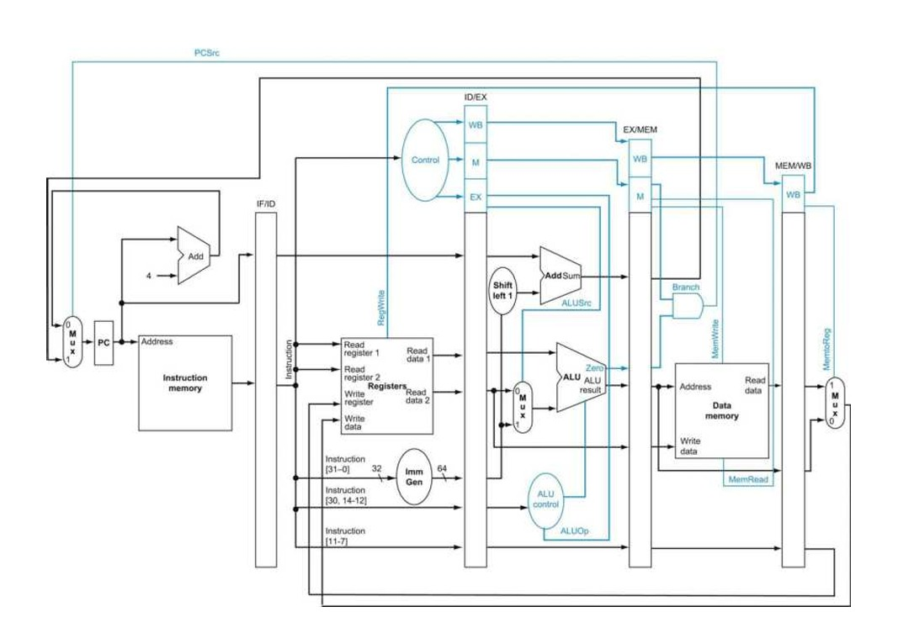
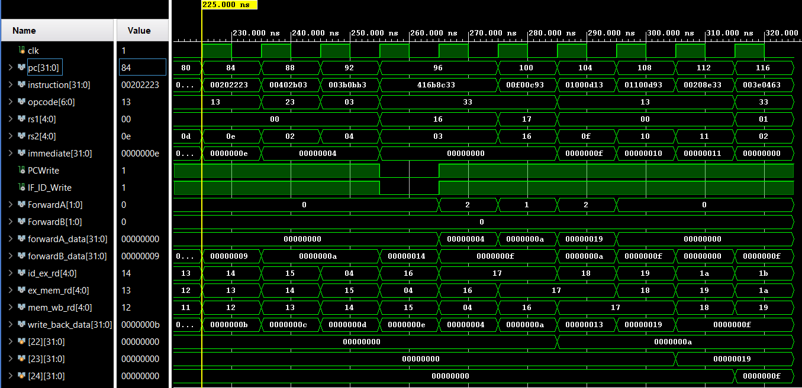

# RV32I 5-Stage Pipelined Processor

An **RV32I-subset RISC-V processor** built from scratch in Verilog, implementing a classic **5-stage pipeline** (IF → ID → EX → MEM → WB) with full hazard handling — data forwarding, load-use stalling, and branch/jump flushing. Every module is independently unit-tested, and the integrated processor is verified against **9 targeted top-level test cases**, each isolating a specific pipeline hazard or edge case with waveform proof.

---

## 1. Project Overview

This project implements an RV32I-subset pipelined CPU core entirely in Verilog, from the individual functional blocks (ALU, register file, control unit, hazard/forwarding logic) up through a fully integrated 5-stage pipeline. The goal was to build and verify each hazard-handling mechanism a real pipelined processor needs — not just get a datapath to compute correctly, but to prove correctness *under* data hazards, control hazards, and mid-execution reset.

---

## 2. Architecture



The processor implements a classic five-stage pipeline:

**IF → ID → EX → MEM → WB**

Hazard detection, forwarding, and pipeline flushing are integrated around the pipeline registers to maintain correct execution.

| Stage | What happens |
|---|---|
| **IF** – Instruction Fetch | `PC` addresses `instruction_memory`; `PC+4` computed in parallel |
| **ID** – Instruction Decode | Register file read, immediate generation, control signal decode |
| **EX** – Execute | ALU operation, operand forwarding, branch/jump target + condition resolution |
| **MEM** – Memory Access | Load/store to `data_memory` |
| **WB** – Write Back | Result written back into the register file |

A normal instruction progresses through the five pipeline stages (IF → ID → EX → MEM → WB), with its destination register updated during the WB clock edge.

### Modules Present in Each Stage

**Instruction Fetch (IF)**
- Program Counter (`pc.v`)
- PC + 4 Adder
- Instruction Memory (`instruction_memory.v`)
- IF/ID Pipeline Register (`if_id_register.v`)

**Instruction Decode (ID)**
- Register File (`register_file.v`)
- Immediate Generator (`immediate_generator.v`)
- Main Control Unit (`control_unit.v`)
- Hazard Detection Unit (`hazard_detection_unit.v`)

**Execute (EX)**
- Forwarding Unit (`forwarding_unit.v`)
- ALU Control Unit (`alu_control.v`)
- Arithmetic Logic Unit (`alu.v`)
- Branch Unit (`branch_unit.v`)

**Memory Access (MEM)**
- Data Memory (`data_memory.v`)
- EX/MEM Pipeline Register (`ex_mem_register.v`)

**Write Back (WB)**
- MEM/WB Pipeline Register (`mem_wb_register.v`)
- Register File Write Back

---

## 3. Pipeline Features

**Pipeline Registers**
- IF/ID
- ID/EX
- EX/MEM
- MEM/WB

**Data Hazard Handling**
- Forwarding Unit
- Hazard Detection Unit
- Pipeline Stall Generation

**Control Flow**
- Branch Unit
- PC Selection Logic

---

## 4. Features

- Full 5-stage pipeline with all four pipeline registers (`IF/ID`, `ID/EX`, `EX/MEM`, `MEM/WB`)
- EX/MEM and MEM/WB **data forwarding**, with correct **forwarding-priority** resolution when both sources are valid
- **Load-use hazard detection** with automatic single-cycle stall + bubble insertion
- **Branch and jump support** with pipeline flush on redirect
- Hardwired **`x0` register** (writes silently dropped, reads always return 0)
- Mid-execution **reset** correctly discards in-flight instructions without corrupting already-committed register state
- 15 standalone unit testbenches (one per module) + 9 end-to-end integration testbenches, each with a corresponding waveform screenshot

---

## 5. Supported Instructions

### Instruction Formats

- R-Type
- I-Type
- S-Type
- B-Type
- U-Type
- J-Type

### Arithmetic / Logical
- ADD, SUB
- AND, OR, XOR
- SLL, SRL, SRA
- SLT, SLTU

### Immediate
- ADDI, ANDI, ORI, XORI
- SLLI, SRLI, SRAI
- SLTI, SLTIU

### Memory
- LB, LH, LW
- LBU, LHU
- SB, SH, SW

### Control Flow
- BEQ, BNE
- BLT, BGE
- BLTU, BGEU
- JAL, JALR

### Upper Immediate
- LUI
- AUIPC

> **Note:** This project implements the RV32I instructions listed above. Other RV32I instructions such as `FENCE`, `ECALL`, and `EBREAK` are not implemented.

---

## 6. Hazard Handling

### Forwarding
EX/MEM and MEM/WB forwarding paths feed both ALU operands (`forwarding_unit.v`). When both an EX/MEM and a MEM/WB source are valid for the same register (two consecutive writes to the same destination, read shortly after), **EX/MEM forwarding takes priority**, since it holds the more recently computed value.

### Load-Use Stall
A load-use hazard (`ID_EX_MemRead` combined with a matching destination register) asserts `PCWrite = 0` and `IF_ID_Write = 0` for exactly one cycle, injecting a bubble via `ControlMux` (`hazard_detection_unit.v`). The one-cycle stall allows the load to advance so that its result can be forwarded from MEM/WB to the dependent instruction.

### Branch / Jump Flush
`flush = PCSrc`, wired into `if_id_register` and `id_ex_register`. A flush zeroes only the *control* signals (`RegWrite`, `MemRead`, `MemWrite`, `Branch`, `Jump`, `JALR`) of the wrongly-fetched instruction, turning it into an inert bubble that then propagates harmlessly through the remaining pipeline registers — the instruction was fetched, but never architecturally executes.

### Reset
`reset` is distinct from `flush`: flush neutralizes a specific wrongly-fetched instruction at the ID/EX boundary during normal execution, while `reset` synchronously clears the PC and all pipeline registers while instructions are in flight through the pipeline. Because `register_file.v` has no reset input, register values already committed through WB are preserved; only in-flight state is cleared.

### x0 Hardwiring
Enforced entirely inside `register_file.v` — reads of `x0` are hardwired to `32'b0`, and writes are gated by `rd != 5'd0`, regardless of what upstream control signals say.

---

## 7. Repository Structure

```
RISC-V-Processor/
├── RTL/                          # Synthesizable design source
│   ├── IF/                       # pc.v, instruction_memory.v
│   ├── ID/                       # register_file.v, control_unit.v, immediate_generator.v
│   ├── EXE/                      # alu.v, alu_control.v
│   ├── Branch/                   # branch_unit.v
│   ├── MEM/                      # data_memory.v
│   ├── HAZARD/                   # hazard_detection_unit.v, forwarding_unit.v
│   ├── PIPELINE/                 # if_id_register.v, id_ex_register.v,
│   │                              # ex_mem_register.v, mem_wb_register.v
│   └── TOP/                      # risc_v_processor.v (top-level integration)
│
├── Test_Bench/
│   ├── IF_tb.v/                  # instruction_memory_tb.v, pc_tb.v
│   ├── ID_tb.v/                  # control_unit_tb.v, immediate_generator_tb.v, register_file_tb.v
│   ├── EXE_tb.v/                 # alu_control_tb.v, alu_tb.v
│   ├── Branch_tb.v/              # branch_unit_tb.v
│   ├── MEM_tb.v/                 # data_memory_tb.v
│   ├── Hazard_tb.v/              # forwarding_unit_tb.v, hazard_detection_unit_tb.v
│   ├── PIPELINE_tb.v/            # ex_mem_register_tb.v, id_ex_register_tb.v,
│   │                              # if_id_register_tb.v, mem_wb_register_tb.v
│   └── TOP_tb/                   # 9 top-level integration testbenches
│       ├── riscv_processor_tb_case1_normal.v
│       ├── riscv_processor_tb_case2_hazard.v
│       ├── riscv_processor_tb_case3_forwarding.v
│       ├── riscv_processor_tb_case4_stall_forwarding.v
│       ├── riscv_processor_tb_case5_branch_jump.v
│       ├── riscv_processor_tb_case6_flush_hazard.v
│       ├── riscv_processor_tb_case7_x0.v
│       ├── riscv_processor_tb_case8_forward_priority.v
│       └── riscv_processor_tb_case9_reset.v
│
├── Memory/
│   └── program.mem               # shared 64-word RV32I instruction image for all 9 cases
│
├── Simulation_Results/           # waveform screenshots, one set per module + per test case
├── Images/                       # architecture reference diagrams
└── README.md
```

---

## 8. Verification Strategy

The design is verified in two layers:

**Unit-level** — every RTL module has its own standalone testbench and waveform (`Simulation_Results/*.png`), confirming each block works in isolation before integration: `pc`, `instruction_memory`, `register_file`, `control_unit`, `immediate_generator`, `alu`, `alu_control`, `branch_unit`, `data_memory`, `hazard_detection_unit`, `forwarding_unit`, and all four pipeline registers.

**Integration-level** — a shared 64-word instruction-memory image (`Memory/program.mem`) drives the fully assembled `riscv_processor` top module through **9 targeted scenarios**, each with its own testbench and waveform, isolating one specific pipeline behavior at a time.

---

## 9. The 9 Integration Test Cases

| # | Test | Start PC | Instructions | What it proves |
|---|------|----------|---------------|-----------------|
| 1 | **Normal** | 0 | 0–24 | Straight-line `addi` sequence — no hazards, values land in the correct registers in order |
| 2 | **Load-Use Hazard** | 28 | 28–36 | `lw` followed immediately by a dependent `add` → hazard detected, 1-cycle stall inserted, then MEM/WB forward delivers the correct value |
| 3 | **Forwarding** | 56 | 56–64 | Back-to-back ALU dependencies resolved purely by EX/MEM and MEM/WB forwarding, with **no stall** |
| 4 | **Stall + Forwarding** | 84 | 84–96 | Combines a load-use stall *and* the forwarding that follows it, on a second load target |
| 5 | **Branch / Jump** | 112 | 112–136 | Taken BEQ and JAL redirects correctly flush wrong-path instructions; the branch comparison also exercises operand forwarding |
| 6 | **Flush + Hazard** | 140 | 140–160 | `bne` (taken) flushes two instructions, one of which would have created a hazard on `x6` if not correctly discarded |
| 7 | **x0 Hardwiring** | 168 | 168–192 | Direct and indirect writes to `x0` are silently dropped; reads of `x0` always return `0`, never forwarded |
| 8 | **Forwarding Priority** | 196 | 196–220 | Two consecutive writes to the same destination register (e.g. `addi x16,x0,5` then `addi x16,x0,10`) — a following instruction reading `x16` must receive the **newer, EX/MEM-forwarded** value (10), not the older MEM/WB value (5) |
| 9 | **Mid-Pipeline Reset** | 224 | 224–252 | `reset` asserted while an instruction is in-flight: that instruction is discarded, register values already committed through WB are preserved, and the pipeline cleanly restarts from `PC = 0` |

Each case's waveform is available in `Simulation_Results/` and shows the mechanism firing (stall/forward/flush signals) alongside the final register values that confirm correctness. Cases 5, 6, and 9 also have extended "other variables" / "all registers" waveforms (`riscv_processor_branch_jump_other_variables.png`, `riscv_processor_flush_hazard_other_variables.png`, `riscv_processor_reset_case_9_all_registers.png`) tracing every affected register through the flush/reset for a more complete proof.

---

## 10. Verification Summary

| Verification Level | Tests | Result |
|---|---:|---|
| Unit-level | 15 modules | Passed |
| Integration-level | 9 scenarios | Passed |
| Data hazards | Stall + Forwarding | Verified |
| Control hazards | BEQ / BNE / JAL / JALR (flush) | Verified |
| x0 behavior | Read / write protection | Verified |
| Reset behavior | Mid-pipeline reset | Verified |

---

## 11. Sample Waveform



**Case 4 — Stall + Forwarding.** A load-use stall (`PCWrite`/`IF_ID_Write` drop for one cycle) followed by EX/MEM and MEM/WB forwarding into the next instruction — both mechanisms visible in the same trace, with the final register values confirming the computed result is correct.

---

## 12. Key Implementation Details

- **`ALUSrcA`** — a 2-bit select supporting `rs1`, zero (`LUI`), and `PC` (`AUIPC`) as the ALU's first operand.
- **`ResultSrc`** — widened to 2 bits to support three write-back sources: ALU result, memory read data (`LW`/`LB`/`LH`/...), and `PC+4` (the link value for `JAL`/`JALR`).
- **`x0` protection** — reads of `x0` are hardwired to `32'b0` and writes to `x0` are silently dropped, enforced entirely inside `register_file.v` regardless of upstream control signals.
- **Forwarding priority** — when both EX/MEM and MEM/WB hold a valid, matching source register, `forwarding_unit.v` always selects EX/MEM, since it is the more recently produced value (Case 8).
- **Byte/halfword memory access** — `data_memory.v` decodes `funct3` to support byte, halfword, and word loads (with correct sign/zero extension) and stores, not just word-aligned `LW`/`SW`.
- **Dual asynchronous read ports** — `register_file.v` reads `rs1`/`rs2` combinationally (via `assign`, not clocked), so decoded operands are available within the same cycle without waiting for a clock edge.

---

## 13. How to Run

The design was developed and verified using **Xilinx Vivado** (Behavioral Simulation).

1. Create a new Vivado RTL project.
2. Add all Verilog files under `RTL/` as design sources.
3. Add the desired testbench from `Test_Bench/TOP_tb/` as a simulation source.
4. Ensure `Memory/program.mem` is accessible to the simulation (referenced by `instruction_memory.v`).
5. Run Behavioral Simulation.
6. Select the desired case (`riscv_processor_tb_case1_normal.v` through `riscv_processor_tb_case9_reset.v`).
7. Inspect the resulting waveform/results.

The nine integration testbenches correspond to the nine verification scenarios described above (Section 9).

---

## 14. Tools Used

- **Design & Simulation**: Xilinx Vivado (Behavioral Simulation)
- **HDL**: Verilog-2001
- **ISA**: RV32I instruction subset — see Section 5

---

## 15. Author

N. Akhil — Electronics and Communication Engineering, NIT SURAT
